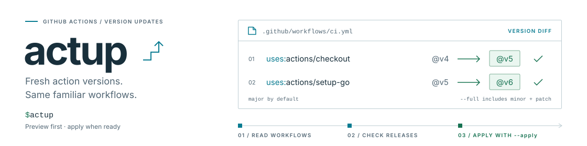

<picture>
  <source media="(prefers-color-scheme: dark)" srcset=".github/banner.svg">
  <source media="(prefers-color-scheme: light)" srcset=".github/banner-light.svg">
  
</picture>

`actup` checks the GitHub Actions used in a repository and updates their version references.

## Installation

Download the release for your platform from [releases](https://github.com/coalaura/actup/releases), extract the executable and place it on your `PATH`.

## Usage

Run `actup` from the root of a repository:

```sh
actup
```

By default, `actup` reports available major-version updates without changing any files.

```sh
# Apply major-version updates.
actup --apply

# Report minor and patch updates as well.
actup --full

# Apply all available updates.
actup --full --apply

# Check a single workflow file instead of .github/workflows.
actup --file .github/workflows/release.yml
```

Use `actup --help` to view all command options.

## Behavior

- Workflow files are read from `.github/workflows` or from the single file given with `--file`.
- Both `.yml` and `.yaml` files are supported.
- Every file read and action found is listed; actions with an update are highlighted.
- Versions are resolved from each action's latest GitHub release.
- The default mode updates references to major tags such as `v4`.
- `--full` uses the complete release version, such as `v4.2.1`.
- Local actions and non-semantic version references, such as branches and commit hashes, are left unchanged.
- Files are written only when `--apply` is provided.
